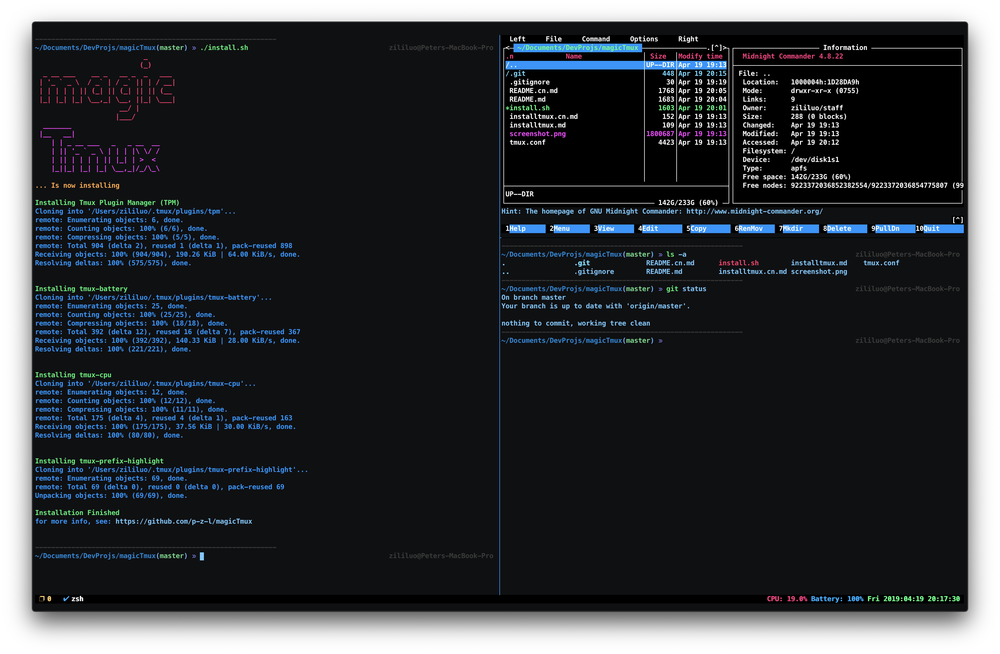

# tmuxconfig

**一个（超级炫酷的） Tmux 配置文件**

## 安装

你可能需要事先 <a href="installtmux.cn.md">安装 tmux</a>

如果你已经安装了 Tmux：

在 Linux/macOS 上：

`curl -fsSL "https://raw.githubusercontent.com/peterzililuo/tmuxconfig/master/install.sh" | /bin/sh`

在 Windows 上：
手动把这个仓库 Clone 下来然后手动安装
（以后会提供针对 Windows 自动化安装脚本）

## 使用

**在这个配置中，快捷键前缀被改为了 `<C-x>`，其他快捷键如下：**

**Panes**

`<prefix> 1` 在右侧添加 Pane

`<prefix> 2` 在下方添加 Pane

`<prefix> 0` 关闭 Pane

`<prefix> o` 在 Pane 之间切换

`<prefix> H` 向左扩大 Pane

`<prefix> J` 向下扩大 Pane

`<prefix> K` 向上扩大 Pane

`<prefix> L` 向右扩大 Pane

`<prefix> m` 最大化/还原 Pane

`<prefix> h/j/k/l` 在 Pane 之间切换

***

**Windows**

`<prefix> c` 创建新 Window

`<prefix> <C-h>` 切换至左侧 Window

`<prefix> <C-l>` 切换至右侧 Window

`<prefix> q` 关闭 Window

***

**Status bar**

`<prefix> s` 隐藏/显示状态栏

其他快捷键和默认配置相同

## 酷炫功能

**在右下角显示一些神奇的状态**

*prefix按钮， 电池剩余，CPU 使用率，当前时间*

**在 `~/.tmux.conf` 里有很多个性化设置**

*你可以在 `~/.tmux.conf` 里看到一堆你从未体验过的神奇的设置选项（只需体验三分宗，你就会爱上这写配置）*

**超好用的快捷键**

*Tmux 原生快捷键很垃圾是大家公认的事实*